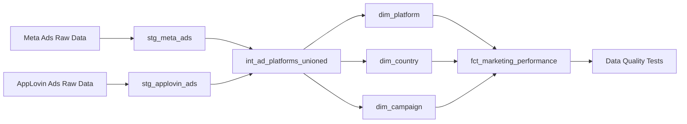
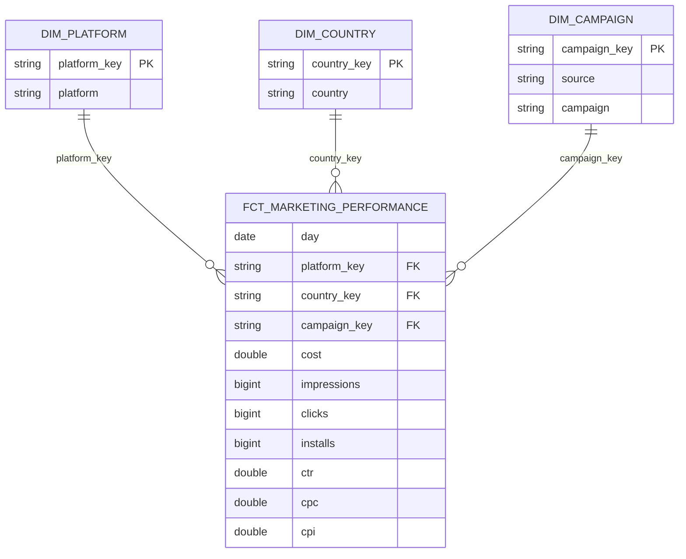
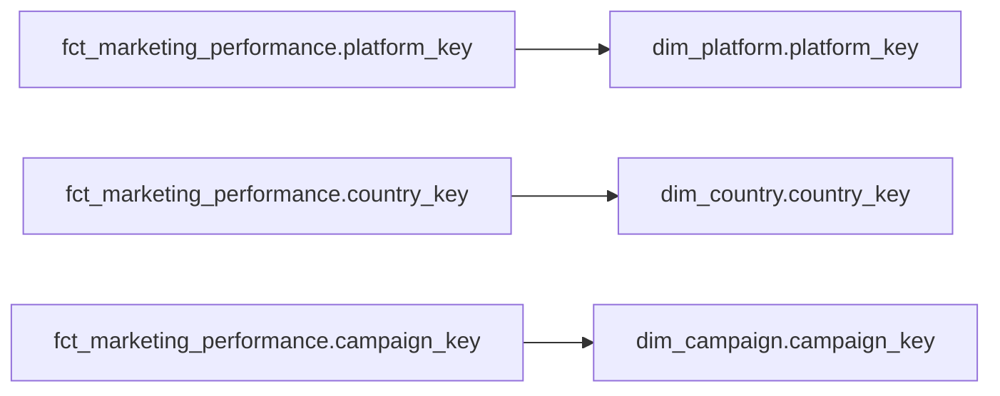
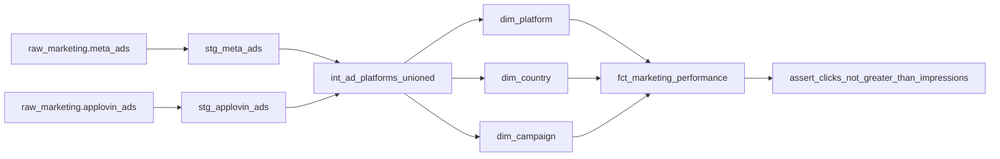

# Marketing Analytics dbt Project

A production-style analytics engineering project built with **dbt Core** and **DuckDB**.

The project transforms multi-source advertising data into a tested, documented, incremental star schema and demonstrates practical dbt concepts such as:

- Sources
- Source freshness
- Staging and intermediate models
- Fact and dimension modeling
- Incremental models
- Jinja macros
- Generic and singular tests
- Relationship tests
- Snapshots / SCD Type 2
- Documentation and lineage
- GitHub Actions CI

---

## Architecture



The transformation flow is:

```text
Raw Sources
    ↓
Staging
    ↓
Intermediate
    ↓
Dimensions
    ↓
Fact Table
    ↓
Tests / Documentation
```

---

## Data Model

The mart layer uses a simple **star schema**.



### Fact Table Grain

The grain of `fct_marketing_performance` is:

```text
day
+
platform
+
country
+
campaign
+
advertising source
```

Each record represents daily marketing performance for a specific campaign, platform, and country.

---

## Data Sources

The project simulates external marketing data sources using dbt seeds.

Sources:

- Meta Ads
- AppLovin Ads
- Campaign Status

The raw advertising tables are exposed to staging models through dbt `source()` definitions.

Example:

```sql
{{ source('raw_marketing', 'meta_ads') }}
```

The seed tables act as local raw-source simulations for development with DuckDB.

---

## Source Freshness

The raw marketing sources contain a `loaded_at` timestamp.

dbt freshness checks verify whether upstream data is still arriving within the expected SLA.

Example behavior:

```text
Recent data       → PASS
Moderately stale  → WARN
Too old           → ERROR
```

Freshness can be checked with:

```bash
dbt source freshness
```

This helps detect stale or delayed upstream data before downstream models are trusted.

---

## Staging Layer

The staging layer standardizes raw marketing data.

Models:

```text
stg_meta_ads
stg_applovin_ads
```

Typical transformations include:

- Date casting
- Platform normalization
- Country normalization
- Numeric type casting
- Standardized column naming

Example dependency:

```text
raw_marketing.meta_ads
        ↓
stg_meta_ads
```

---

## Intermediate Layer

The model:

```text
int_ad_platforms_unioned
```

combines Meta Ads and AppLovin Ads into a common advertising schema.

The standardized structure contains:

```text
day
platform
country
campaign
source
cost
impressions
clicks
installs
```

The `source` column identifies the originating advertising platform.

---

## Dimension Tables

### `dim_platform`

Stores unique advertising platforms.

```text
platform_key
platform
```

Example values:

```text
android
ios
```

### `dim_country`

Stores unique country values.

```text
country_key
country
```

### `dim_campaign`

Stores campaigns by advertising source.

```text
campaign_key
source
campaign
```

The key is generated from:

```text
source + campaign
```

This ensures that campaigns with the same name on different advertising platforms remain distinct.

For example:

```text
meta + retargeting
```

and:

```text
applovin + retargeting
```

receive different surrogate keys.

---

## Fact Table

The final analytical model is:

```text
fct_marketing_performance
```

It contains foreign keys to the dimension tables:

```text
platform_key
country_key
campaign_key
```

and the main marketing metrics:

```text
cost
impressions
clicks
installs
ctr
cpc
cpi
```

---

## Marketing Metrics

### CTR

Click-through rate:

```text
Clicks / Impressions
```

### CPC

Cost per click:

```text
Cost / Clicks
```

### CPI

Cost per install:

```text
Cost / Installs
```

These calculations are generated through a reusable dbt macro.

---

## Incremental Model

`fct_marketing_performance` is implemented as an **incremental model**.

The composite unique key is:

```text
day
platform_key
country_key
campaign_key
```

During normal incremental runs, only recent data is processed rather than rebuilding the entire fact table.

The model uses `is_incremental()` to apply incremental filtering.

A full rebuild can still be performed when necessary:

```bash
dbt run --select fct_marketing_performance --full-refresh
```

---

## Macros

The project contains a reusable Jinja macro:

```text
calculate_ratio
```

It is used for calculations such as:

- CTR
- CPC
- CPI

Example usage:

```sql
{{ calculate_ratio('sum(cost)', 'sum(clicks)', 2) }}
```

This keeps repeated calculation logic centralized and reduces SQL duplication.

---

## Data Quality Tests

The project includes multiple types of dbt tests.

### Built-in Tests

Built-in tests include:

```text
not_null
unique
accepted_values
relationships
```

These validate rules such as:

- Required fields cannot be null
- Dimension keys must be unique
- Platform values must be valid
- Fact foreign keys must exist in their related dimensions

---

## Custom Generic Test

A reusable generic test verifies that numeric metrics cannot be negative.

Test:

```text
non_negative
```

It is applied to:

```text
cost
impressions
clicks
installs
ctr
cpc
cpi
```

The test returns failing rows when a value is below zero.

---

## Singular Business Rule Test

The project also contains a custom singular test:

```text
assert_clicks_not_greater_than_impressions
```

Business rule:

```text
clicks <= impressions
```

Any violating records cause the test to fail.

---

## Relationship Tests

Foreign-key relationships between the fact and dimension tables are validated using dbt relationship tests.



This helps detect orphaned fact records.

---

## Snapshots and SCD Type 2

The project includes a dbt snapshot:

```text
campaign_status_snapshot
```

It tracks historical campaign status changes.

Example:

```text
summer_sale

active
2026-09-20 → 2026-09-23

paused
2026-09-23 → current
```

Instead of overwriting the old state, dbt preserves both versions.

The snapshot uses:

```text
strategy: timestamp
unique_key: campaign_id
updated_at: updated_at
```

Typical snapshot metadata includes:

```text
dbt_valid_from
dbt_valid_to
dbt_scd_id
```

This demonstrates **Slowly Changing Dimension Type 2** behavior.

---

## Documentation and Lineage

dbt documentation can be generated locally using:

```bash
dbt docs generate
dbt docs serve
```

The lineage graph shows dependencies between:

- Sources
- Staging models
- Intermediate models
- Dimensions
- Fact table
- Tests

Example lineage:



---

## Continuous Integration

The repository includes a **GitHub Actions CI pipeline**.

The workflow runs automatically on:

```text
push → main
pull request → main
```

The CI process is:


The CI workflow validates the project in a clean environment.

It ensures that:

- SQL models compile
- Source tables can be loaded
- Models can be built
- Data tests pass
- Broken changes are detected automatically

---

## Project Structure

```text
marketing_analytics_dbt/
│
├── .github/
│   └── workflows/
│       └── dbt-ci.yml
│
├── models/
│   ├── staging/
│   │   ├── _sources.yml
│   │   ├── _staging_models.yml
│   │   ├── stg_meta_ads.sql
│   │   └── stg_applovin_ads.sql
│   │
│   ├── intermediate/
│   │   └── int_ad_platforms_unioned.sql
│   │
│   └── marts/
│       ├── dimensions/
│       │   ├── dim_platform.sql
│       │   ├── dim_country.sql
│       │   └── dim_campaign.sql
│       │
│       ├── _marketing_models.yml
│       └── fct_marketing_performance.sql
│
├── macros/
│   └── calculate_ratio.sql
│
├── seeds/
│   ├── meta_ads.csv
│   ├── applovin_ads.csv
│   └── campaign_status.csv
│
├── snapshots/
│   └── campaign_status_snapshot.yml
│
├── tests/
│   ├── assert_clicks_not_greater_than_impressions.sql
│   └── generic/
│       └── test_non_negative.sql
│
├── dbt_project.yml
└── README.md
```

---

## Running the Project

### Requirements

- Python 3.10+
- dbt Core
- dbt-duckdb
- Git

Install dbt and DuckDB adapter:

```bash
python -m pip install dbt-duckdb
```

Verify installation:

```bash
dbt --version
```

---

### Validate Configuration

```bash
dbt debug
```

---

### Load Seed Data

```bash
dbt seed --full-refresh
```

---

### Run Models

```bash
dbt run
```

---

### Run Tests

```bash
dbt test
```

---

### Run the Full Pipeline

```bash
dbt build
```

---

### Check Source Freshness

```bash
dbt source freshness
```

---

### Run Snapshots

```bash
dbt snapshot
```

---

### Generate Documentation

```bash
dbt docs generate
dbt docs serve
```

---

## Technology Stack

| Technology | Purpose |
|---|---|
| dbt Core | Analytics transformation framework |
| DuckDB | Local analytical database |
| SQL | Data transformation |
| Jinja | Dynamic SQL and reusable logic |
| Git | Version control |
| GitHub | Repository hosting |
| GitHub Actions | Continuous Integration |

---

## Concepts Demonstrated

This project demonstrates practical usage of:

- Analytics engineering
- ELT workflows
- dbt Sources
- Source freshness
- Staging models
- Intermediate models
- Fact tables
- Dimension tables
- Star schema
- Incremental models
- Composite unique keys
- Surrogate keys
- Jinja macros
- Built-in dbt tests
- Generic custom tests
- Singular tests
- Relationship tests
- Snapshots
- SCD Type 2
- Documentation
- Data lineage
- Git version control
- GitHub Actions CI

---

## Project Purpose

This project was created as a practical implementation of a modern analytics engineering workflow.

The goal is to demonstrate how dbt can be used not only to transform data, but also to build analytical pipelines that are:

- Modular
- Testable
- Documented
- Incremental
- Historically traceable
- Version controlled
- Automatically validated through CI
